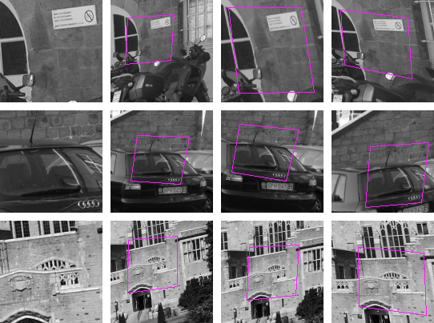

# Introduction

The idea of this work is similar to: https://arxiv.org/abs/1606.03798

- [Objective](#objetive)
  - [Training Dataset](#training-dataset)
  - [Model CNN](#model-cnn)
  - [Test](#Test)
- [Requirements](#requirements)


# Objetive

The goal of this network is the following:

	- given two images (I1, I2) with I1 in I2
	- return the four corners in I2 that enclose I1

In other words, this work tries to find the homography between I1 and I2.


## Training Dataset

To train this model we need thousands of samples.

2 Additionaly we could simple use some image dataset (MIRFLCKR, IMAGENET) and for each image perform some 
random changes, including perspective transformations, illumination, blurring changes...

The input training data consist in:
- Two images of size (128 x 128)

The training label consist in:
- Four corners: (x1, y1, x2, y2, x3, y3, x4, y4)



## Model CNN

The error of the network is computed following the eq():

	Dist_Euclidean( predicted_corners - groundTruth_corners)


## Test

For test the funtionallity of this model we use several datasets in which the homographies ground-truth are providad
 (Oxford, Nothredame?? ). 

Additionally, we could extract several patches for each imagen to grow up the number of test-samples.


# Requirements

## [OpenCV](https://github.com/opencv/opencv)
http://opencv.org/

## Python
### python-opencv

```
sudo apt-get install python-opencv
```
### Numpy
```
pip install numpy
```
### python-matplotlib
To display plots on python

```
sudo apt-get install python-matplotlib
```

## [Tensorflow](TF_installation_guide.md)
https://www.tensorflow.org/install/